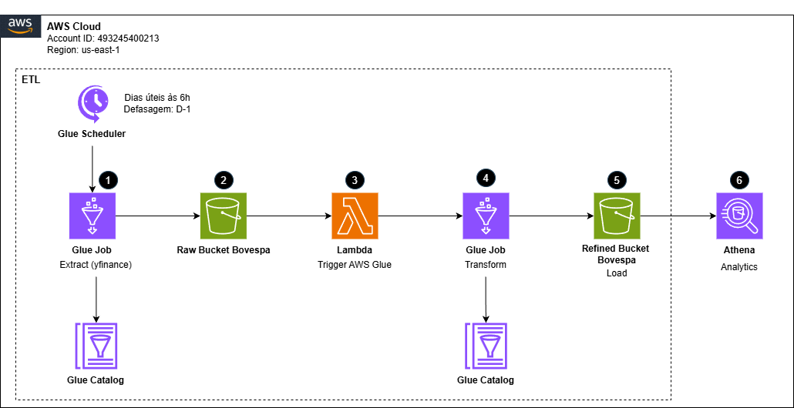

# Pipeline Batch B3: ingestão e arquitetura de dados

Este projeto implementa um fluxo de pipeline batch de dados automatizado para a ingestão, processamento e análise de dados da B3 (Bovespa), utilizando serviços AWS (Amazon Web Servies) como S3, Glue, Lambda e Athena.

Autora: Alice Beatriz da Silva
Última atualização: 10/01/2026
Apresentação do projeto (vídeo):

 

## Índice
- [Contexto](#contexto)  
- [Arquitetura do Pipeline de Dados](#arquitetura-do-pipeline-de-dados) 
- [Resultados: dicionario de dados e insights](#resultados) 
- [Tecnologias](#tecnologias)  
- [Próximos Passos](#proximos-passos)

 

---

## Contexto
Este projeto foi desenvolvido para fins de avaliação no curso "Engenharia de Machine Learning - FIAP". A proposta é construir um pipeline de dados completo, com o objetivo de extrair, processar e analisar dados históricos de ações ou índices da B3 (Bolsa de Valores Brasileira), utilizando arquitetura baseada em Cloud Computing.

O pipeline deverá ser capaz de realizar a ingestão diária de dados financeiros e passar por etapas de processamento e transformação, com o objetivo de gerar dados mais refinados e de fácil análise. A solução envolve desde a captura dos dados brutos até a disponibilização desses dados para consultas via SQL. Veja:

 

---

## Arquitetura do Pipeline de Dados

 

 

1.  **Ingestão dos dados de ações ou índices da B3:** A ingestão é feita diariamente através do Glue Job *"ETL-pipeline-batch-bovespa-extract"* agendado para rodar nos dias úteis às 6h00, fazendo a leitura dos dados da biblioteca yfinance. O yfinance é uma biblioteca Python popular para acessar dados financeiros de forma fácil e rápida, principalmente os dados históricos de ações, índices, e outros instrumentos financeiros, obtidos através da API do Yahoo Finance.
2. **Armazenamento no AWS S3:** Os dados brutos são armazenados no S3 (*s3://pipeline-etl-bovespa/raw/*) em formato Parquet, com partições diárias, o que permite uma maior eficiência na leitura e na consulta dos dados.
3. **Trigger via AWS Lambda:** A entrada de novos dados no S3 aciona a função Lambda (*pipeline-bovespa*). Esta função Lambda, por sua vez, será responsável por iniciar o Glue Job *"ETL_pipeline_bovespa_transform_load"* que atua na etapa de transform e load dos dados.
4. **Transformações no AWS Glue:** O Glue Job *"ETL_pipeline_bovespa_transform_load"* é responsável por realizar as transformações de engenharia de feature: agrupamento e sumarização, renomeação de colunas, tratamento de dados e cáculos baseados em data.
5. **Armazenamento refinado e catalogação no Glue Catalog:** Os dados refinados são armazenados no S3 (*s3://pipeline-etl-bovespa/refined/*), também em formato Parquet e particionados por data e pelo nome ou código da ação/índice. Além disso, o *AWS Glue Catalog* é atualizado automaticamente com os dados refinados, criando tabelas que possam ser acessadas para análise posterior.
6. **Consulta via Athena:** Após o refinamento dos dados, os dados podem ser consultados diretamente por SQL, utilizando o AWS Athena, que possibilita consultas rápidas e econômicas sobre os dados armazenados no S3.

 

---

## Resultados

Esta é a estrutura final da tabela disponível no Amazon Athena para análise. Ela consolida os dados de mercado com indicadores calculados durante a fase de engenharia de dados.

 

### Dicionário de Dados

| **Campo**               | **Descrição**                                                                 | **Exemplo**               |
|-------------------------|-------------------------------------------------------------------------------|---------------------------|
| `data_hora`             | Timestamp do registro (D-0).                                                  | 2026-01-02 00:00:00       |
| `cod_papel`             | Ticker oficial da ação/índice na B3.                                         | BBAS3.SA                  |
| `valor_fechamento`      | Preço de fechamento ajustado.                                                 | 21.68                     |
| `abertura`              | Preço de abertura do pregão.                                                  | 22.05                     |
| `valor_max / valor_min` | Máxima e mínima atingida no dia.                                              | 22.20 / 21.63             |
| `quant_negociacoes`     | Volume total de negociações no dia.                                           | 16.077.000                |
| `amplitude`             | Diferença entre a máxima e a mínima do dia.                                    | 0.57                      |
| `variacao_1d`           | Percentual de variação em relação ao dia anterior.                            | -1.09%                    |
| `variacao_30d / 60d`    | Performance acumulada em janelas de tempo.                                    | 5.98%                     |
| `max / min_30d`         | Teto e piso de preço nos últimos 30 dias.                                      | 22.77 / 21.16             |
| `particao`              | Identificador de partição para otimização (YYYYMMDD).                         | 20260102                  |

 

A partir dos dados fornecidos pela tabela, diversos insights podem ser extraídos, dependendo do objetivo da análise e das perguntas de negócio. Aqui estão alguns exemplos de insights que podem ser tirados desses dados financeiros:

1. Valor de Fechamento vs. Abertura
2. Amplitude (Diferença Máxima - Mínima)
3. Variação Diária (variacao_1d)
4. Variação Acumulada em 30/60 dias (variacao_30d, variacao_60d)
5. Máximas e Mínimas de 30 dias (max_30d, min_30d)
6. Volume de Negociações (quant_negociacoes)
7. Identificação de Padrões Sazonais (particao)
8. Relação entre Preço e Volume
9. Análise de Risco e Retorno
10. Evolução do Ativo ao Longo do Tempo

  

---

## Tecnologias

Este projeto faz uso de diversas tecnologias avançadas para garantir uma solução eficiente, escalável e fácil de manter. Abaixo estão as principais ferramentas e serviços utilizados para a construção do pipeline de ingestão e processamento de dados da Bovespa.

 

### Tecnologias de processamento e armazenamento

- **AWS Glue** – Serviço totalmente gerenciado de ETL (Extract, Transform, Load) para realizar o processamento, transformação e integração de dados de maneira escalável.

- **Apache Spark** – Framework de processamento distribuído, utilizado dentro do AWS Glue para operações de transformação de dados em larga escala.

- **Amazon S3** – Repositório de dados utilizado para armazenar os dados brutos e refinados no formato Parquet, com particionamento diário para otimização de consulta.

- **Amazon Athena** – Serviço de consulta interativo que permite executar SQL diretamente sobre dados armazenados no Amazon S3, facilitando a análise e geração de relatórios.

### Tecnologias de Orquestração e Automação

- **AWS Lambda** – Serviço serverless que automatiza e orquestra o fluxo de trabalho entre os diferentes serviços do pipeline. No projeto, o Lambda é responsável por acionar o job de ETL no AWS Glue sempre que novos dados são carregados no S3.

- **Amazon CloudWatch** – Serviço de monitoramento para rastrear logs e performance do pipeline, garantindo que todos os jobs e processos sejam executados corretamente.

### Ferramentas de Coleta de Dados

- **yfinance** – Biblioteca Python utilizada para extrair dados históricos de ações da B3 através da API do Yahoo Finance. Esta ferramenta automatiza o processo de coleta de dados financeiros da bolsa.

### Destaques do Projeto

- **Processamento Distribuído**: Utilização do Apache Spark no AWS Glue para realizar transformações de dados em grande escala, otimizando o tempo de processamento.

- **Armazenamento Eficiente**: Dados armazenados no Amazon S3 no formato Parquet, permitindo uma consulta rápida e eficiente com particionamento diário.

- **Automação Completa**: A integração entre AWS Lambda e AWS Glue permite a execução automatizada do pipeline, desde a coleta de dados até a análise.

- **Consultas SQL com Athena**: A análise de dados é feita com Amazon Athena, utilizando consultas SQL padrão sobre os dados armazenados no S3, o que facilita a criação de relatórios e insights.

- **Escalabilidade**: O uso de AWS Glue e Amazon S3 garante que o pipeline possa escalar conforme o volume de dados cresce, sem comprometer a performance

 

---

## Próximos Passos

O projeto já possui uma base robusta para ingestão, processamento e análise de dados financeiros, mas para garantir a integridade e a confiabilidade dos dados ao longo do tempo, é essencial implementar mecanismos de qualidade de dados. Dito isso, destaca-se a necessidade da implementação de regras de qualidade e monitoramento através do AWS Glue Data Quality, assegurando dados consistentes e confiáveis em todo o pipeline.